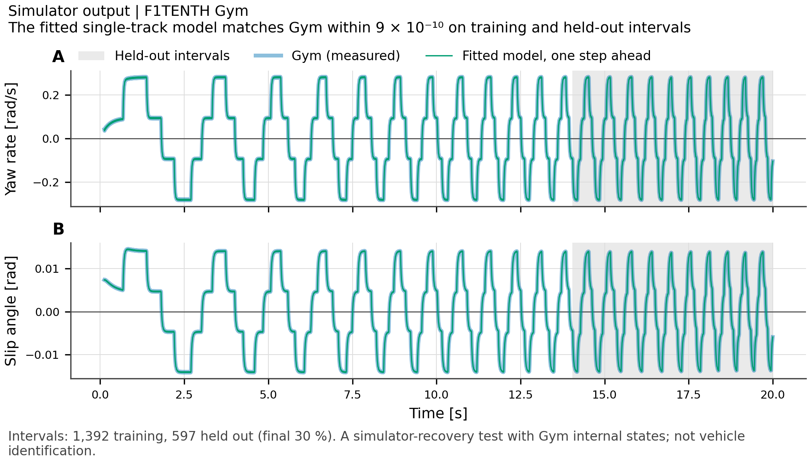

# Autonomous Racing Systems

Vehicle modelling, control and a LiDAR mast design for a 1/10-scale F1TENTH
race car. Public driving data now supports an exploratory command-response
comparison alongside the existing simulations. The mast study includes
hand calculations, FEA and CAD. Its mounting need and study scope must be
settled before fabrication.

[](https://github.com/500ft/autonomous-racing-systems/actions/workflows/ci.yml)
[](https://github.com/500ft/autonomous-racing-systems/actions/workflows/docker.yml)
[](#results)
[](LICENSE)

[Results](#results) · [Roadmap](ROADMAP.md) · [Quick start](#quick-start) ·
[Full report](reports/final_report.md) · [Contributing](CONTRIBUTING.md)



*Same-model simulator identification check; the segment right of the dashed
line is held out. [Figure inputs](docs/data-and-figures.md).*

## What's in the repository

**Public driving data.** On one development run, a delay-plus-affine fit gives
0.386 m/s forward-velocity RMSE versus 0.556 m/s for the no-delay affine baseline.
Its apparent delay is 0.22 s on the recording clock. These are fitted residuals
on the same run. [Result and limitations](reports/real_command_response.md),
including uncalibrated frame alignment and timing, keep this separate from
held-out validation and tire-parameter identification.
[Split qualification](reports/driving_split_qualification.md) stopped before
additional bag access because session and segment membership are undocumented.

**Vehicle software.** A dynamic bicycle model is fitted to telemetry from the
F1TENTH Gym simulator and checked on a held-out segment generated by the same
model. This checks simulator and fitting-code consistency. Pure pursuit, LQR
and MPC controllers and an EKF are compared under the same scenarios, and a ROS 2
bridge converts recorded bags into the same telemetry format the simulator
writes.

**LiDAR mast.** The redesign predicts 285.5 Hz in FEA, but the
[drivetrain analysis](docs/design/16_mechanical_design_analysis.md#61-retrospective-assessment--is-the-200-hz-guard-the-right-criterion-audit-f1)
puts the motor shaft-order crossing near 8.3 m/s. The 200 Hz threshold does
not establish motor-vibration clearance and is under review. Crossing a mode
does not establish harmful vibration either: excitation amplitude, transmission
through the chassis and damping have not been measured.

The original 120 mm tube with a 16 mm outside diameter gave 174.7 Hz by hand
calculation. The redesign is 100 mm long, 20 mm OD, 1.5 mm wall, 6061-T6. It
gives 330.1 Hz by hand and 285.5 Hz in FEA, with less than 1.5% change at the
final refinement of a three-mesh study.

A later study looked at why the FEA came out 13.5% below the hand calculation.
Most of the difference was how the model attached the tip mass: the original
FEA input file hung it from a single node on the tube wall. Coupling it to the tip face
at the centre gives 320.9 Hz, 2.8% from the hand value. This alternate model is
unconverged. Using the same drivetrain relation, its shaft-order crossing is
near 9.35 m/s. The historical 285.5 Hz result retains its original model and
convergence evidence.

The tube, support sleeve and root clamp are parametric SOLIDWORKS parts. The
assembly was built unattended on the CAD host and checked against a separate
CadQuery model: part placement, volumes, a move-and-restore test and a STEP
round trip all match.

## Results

| Result | Value | Source |
| --- | --- | --- |
| Mast first mode, original design (hand) | 174.7 Hz | [Hand calculation](runs/mast_hand_calc/summary.txt) |
| Mast first mode, redesign (hand) | 330.1 Hz | [Design sweep](runs/mast_hand_calc/design_sweep.txt) |
| Mast first mode, redesign (FEA) | 285.5 Hz, < 1.5% change at final mesh refinement | [FEA output](runs/mast_fea/fea_summary.txt) |
| Tip-mass attachment study | 320.9 Hz with a coupled, centred mass; unconverged | [Study record](runs/mast_modal_attachment_20260925/study.json) |
| Motor shaft-order crossing | Near 8.3 m/s for the historical FEA mode | [Drivetrain calculation](experiments/drivetrain_excitation.py) |
| MPC solve time | 1.33 ms at the 95th percentile, inside the 10 ms control period | [MPC report](reports/mpc_controller.md) |
| Controller comparison | Lap completion, cross-track error and steering effort for each controller | [Comparison](reports/controller_comparison.md) |
| Model identification | Held-out yaw-rate error at numerical precision in a same-model simulator consistency check | [Identification study](reports/dynamic_parameter_identification.md) |

## Quick start

This path uses the portable report environment and Python 3.10, the same as
CI. It does not launch ROS or rerun the full simulation study.

```bash
git clone https://github.com/500ft/autonomous-racing-systems.git
cd autonomous-racing-systems
python3.10 -m venv .venv
source .venv/bin/activate
python -m pip install -r requirements-item11-regression.txt
python -m pip install -r requirements-report.txt
PYTHONPATH=gym python experiments/test_cad_inputs.py
PYTHONPATH=gym python experiments/test_final_report.py
```

Both commands should finish with `OK`. They check the design inputs and the
report, including a temporary PDF build.

The [reproduction guide](docs/START_HERE.md#reproduce-by-environment) covers
the full checks, the legacy Gym experiments, ROS 2 and the pinned CadQuery
environment. Keep those environments separate; their dependency versions
differ on purpose.

## What's next

Resolve the mounting need and study scope before fabrication. The owner has
delegated an assessment of the lowest rigid mount that preserves the required
scan field. A low mount is the packaging candidate; its final height and design
remain unapproved. The owner must confirm the sightline and obstruction,
mounting envelope, sensor mass and centre of mass, and whether the intended
claim is assembly modal characterization or suitability for racing. The
[roadmap](ROADMAP.md) records the conditional paths.

## Limits

- Nothing has been built or measured. The mast results are hand calculations,
  FEA and nominal CAD, and the material properties are handbook values for
  6061-T6.
- All vehicle results come from the simulator; physical vehicle performance
  remains untested.
- The ±15% band in the [frozen static protocol](docs/specs/mast-physical-validation/design.md)
  concerns stiffness. Static testing cannot establish modal or vibration
  performance. A racing-suitability claim needs measured excitation and an
  allowed scan error.

## Documentation

| Document | What it covers |
| --- | --- |
| [Reading and reproduction guide](docs/START_HERE.md) | Where to start, and how to rerun each part |
| [Integrated report](reports/final_report.md) | Modelling, controls, estimation and mast results in one place |
| [Data and figures](docs/data-and-figures.md) | Inputs and generator for each figure |
| [Vehicle model](docs/vehicle_model.md) | Equations and assumptions |
| [Telemetry dictionary](docs/telemetry_data_dictionary.md) | The shared data format |
| [Parameter inventory](docs/parameter_inventory.md) | Which inputs are configured, identified or measured |
| [Fixture preparation](cad/roboracer/fixture-preparation.md) | Mast interface and metrology decisions |
| [CAD inventory](docs/CAD_ITEMS.md) | Planned parts and what exists |
| [Literature](literature/README.md) | Sources checked against the project's claims, starting from the [claim ledger](literature/claim-ledger.md) |

```text
gym/          F1TENTH simulator package and dynamics
experiments/  replay, identification, control, telemetry and mast checks
reports/      engineering reports and figures
runs/         study inputs, metrics and solver summaries
ros2_ws/      f1tenth_modeling ROS 2 package
cad/          parametric geometry and its tests
evidence/     check records and regression captures
docs/         models, interfaces, test protocols and guides
```

## Contributing

Read [CONTRIBUTING.md](CONTRIBUTING.md) before changing models, evidence or
generated outputs. A useful pull request says which result it affects, which
environment it ran in, and which checks passed. Open an
[issue](https://github.com/500ft/autonomous-racing-systems/issues) for a
reproducible bug or a scoped proposal.

## License and attribution

[MIT License](LICENSE), keeping the original simulator copyright notice. The
[upstream source register](docs/upstream_roboracer_sources.md) lists the
reference repositories, their licenses and pinned revisions. When citing,
give the repository revision and the report or dataset used. The project was
previously named RoboRacer; package and ROS interface names were not changed
([identity note](docs/REPOSITORY_IDENTITY.md)).
