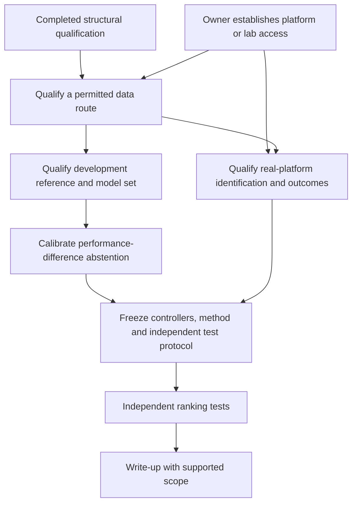

# Roadmap

## Question and finish line

Can dispersion in the predicted performance difference between controllers,
across physically justified vehicle models consistent with development data,
identify rankings that will reverse on a real platform?

Finish with an independently evaluated rule for selecting a controller or
abstaining. Report ranking errors, harmful choices avoided, the fraction of
comparisons retained and the additional real tests required. Compare methods
at matched retention and account for near ties and uncertainty in the observed
performance difference. A result confined to ranking flips between our own
simulators cannot establish real-platform usefulness.

The owner adopted this dependency plan and repository cleanup. Future
milestones describe prerequisites and completion evidence; adoption does not
authorize data exposure, a research campaign, purchases or external contact.
[Open questions](docs/OPEN_QUESTIONS.md) records those decisions separately.

## Verified starting point

**Done:** [structural qualification](reports/ope_qualification.md), including
archive hashes, explicit internal roots, loader aliases, recording boundaries
and exact policy-name matches. The [result](runs/ope_qualification/result.json)
and [generated table](runs/ope_qualification/structure.md) reproduce that work.
Policy execution, episode meaning, independence and reuse permission remain
unqualified. This result supplies no controller-performance or refusal claim.

The licensed [command-response study](reports/real_command_response.md) remains
development evidence. Its [split qualification](reports/driving_split_qualification.md)
admitted no independent final group. Unopened bags remain unassigned and frozen.

## Dependency order

Dataset permission and platform access are parallel routes to evidence.
Qualified existing physical data can support the real-platform branch without
a new car. Owner-approved acquisition can supply a different route if public
data remains unusable. One author's refusal closes that source route; it does
not establish that no legitimate route exists. Neither route is currently ready
for empirical ranking work.

## Milestones and completion evidence

### M1. Qualify an accessible data route

Status: current, blocked on external information and owner choices.
Prerequisite: the structural census and a clearly identified candidate source.

- Obtain terms covering the data, policy code, weights and intended outputs.
  The owner confirms that the email to Fabian Kresse has been sent; the
  [contact record](docs/ope_author_request.txt) records that confirmation.
  Await the author's reply. Sending establishes no reuse permission.
- Resolve raw segment versus episode meaning, continuing terminal flags,
  truncation, exclusions, vehicle/session groups and real/simulation pairing.
- Map policy IDs to executable implementations. Qualify observations, action
  conventions, clipping, internal state and reset behavior.
- Keep FQE target-action execution and coverage separate from IS/WIS/ratio-based
  DR joint-density and support requirements. Never fill missing probabilities
  with constants. Clarify the unresolved helper source named in the report.

Complete when: source-backed rights, episode/group mapping and a tested policy
interface support a declared use, with explicit exclusions and estimator
eligibility. If a route fails, record that reason and let the owner choose
another source or stop; do not inspect reserved outcomes to rescue it.

### M2. Qualify a development reference and model set

Status: future. Prerequisite: M1 for the selected data route and authorization
to use its development data.

- Define the finite-horizon outcome, start-state distribution, collision and
  censoring rules before inspecting performance outcomes.
- Reproduce a reference calculation with independently checked boundary cases.
  Check units, frames, clocks, observations and action conventions before fitting.
- Fit model parameters on development groups only. Retain model discrepancies,
  exclusions and identification uncertainty.
- Introduce parameter and structural variants only with physical justification
  and a declared validity domain. An ensemble cannot guarantee that omitted
  physics is covered.

Complete when: reference computations reproduce, parameters have source support,
model variants have stated assumptions, and separate identification, calibration
and reserved evaluation groups are established without outcome leakage.

### M3. Calibrate a controller-difference abstention rule

Status: future. Prerequisite: M2, qualified candidate controllers and an approved
development protocol.

- Compute each controller pair's performance difference on the same model and
  scenario, then summarize dispersion across the justified model set. Do not
  substitute separate absolute-performance spreads for paired differences.
- Define the direction of preference, a justified near-tie region and how
  uncertain reference outcomes enter scoring before calibration.
- Calibrate abstention using development/calibration groups. Compare fit
  residuals, out-of-distribution indicators, parameter uncertainty, simple
  ensemble disagreement, nominal simulation and whole-run uncertainty.
- Inspect SPOTA as candidate prior work or a baseline for applicability before
  choosing an implementation. Its name establishes no estimator eligibility.
  Include FQE and probability-ratio methods only where their distinct gates pass.

Complete when: a frozen candidate rule and eligible baselines report ranking
error versus retained comparisons, near-tie handling and measurement cost on
calibration groups. If simpler coverage explains the benefit, withdraw the claim
of added value from model disagreement. All-comparison refusal is not success.

### M4. Establish real-platform evidence

Status: optional access route, currently blocked for new physical acquisition.
Prerequisites: owner-confirmed platform/lab access and permission for physical
work, or an M1-qualified existing physical dataset. Acquisition and method
preparation can proceed independently only when separately authorized.

- Confirm repeatable operating conditions, sensor/action interfaces and the
  measurements needed to identify the chosen model and performance difference.
- Use independent identification and calibration groups; record actual vehicle,
  track, configuration and shared-session dependencies.
- Qualify repeatability, outcome uncertainty and data sufficiency before
  selecting a confirmatory sample. A proposed run count is not a sample-size
  justification.

Complete when: permitted real-platform records support identification and the
chosen outcome, with defensible independent groups and usable uncertainty.
Building or possessing a car alone does not complete this milestone.

### M5. Freeze and execute independent ranking tests

Status: future, not authorized by this cleanup.
Prerequisites: M3 and M4, qualified independent groups, named reviewer and
explicit approval of the test protocol.

- Freeze controllers, model variants, fitted parameters, abstention thresholds,
  baselines, tie rules, exclusions and metrics before final outcomes are opened.
- Justify test coverage and sample size from the intended comparison and
  observed variation; prevent shared sessions from being counted as independent.
- Evaluate the frozen methods on reserved whole groups. Record ranking errors,
  abstentions and extra real tests needed, including failures and exclusions.
  Changes informed by final outcomes require a new independent evaluation.

Complete when: a reviewer can reproduce the frozen comparison and distinguish
real-platform performance, inadequate evidence and assumption-dependent results.
Unopened driving bags retain their existing roles unless a new qualified split
is approved before exposure.

### M6. Write up the supported result

Status: future. Prerequisite: M5, or a documented stop at an earlier gate.

Complete when: the report traces claims to permitted sources, reproduces the
comparison and states the scope of any negative result or inability to evaluate.
Keep measured rank reversal separate from simulation-only behavior. Publication
and external sharing require the owner's separate decision.

## Retained work and owner-held decisions

The [history index](docs/history/README.md) retains useful simulation baselines,
original FEA results with their corrections, protected CAD generators/contracts,
calibration tools and frozen evidence. Retired fabrication instructions and
planning checkers are removed from active use.

D2 mounting and physical-study scope, K2 disposition of the earlier driving
study, fleet access/adoption, funding, purchases, naming, reviewer and publication
remain unresolved. No mast result constitutes success for the current question.
The delegated low-mount assessment remains provisional; no height or deck design
is approved. Static stiffness cannot establish modal or vibration performance.
