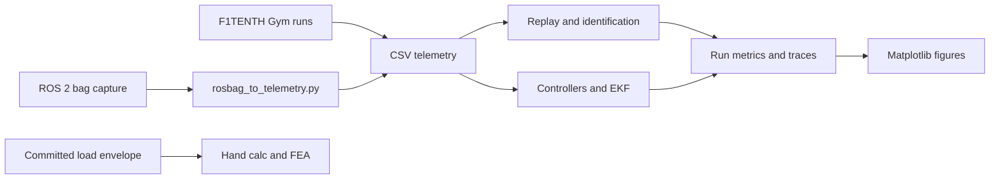

# Data and figure production

This guide connects each result plot to its generator, immediate data inputs,
and evidence class. Detailed interpretation belongs in the linked reports.

The [roadmap](../ROADMAP.md) defines the active dependency order. Future
controller-difference and abstention figures require qualified outcomes; the
current chart reports structure only. The retired concept SVG is recorded in
[history](history/README.md#retired-entrypoints-and-plans).

## Current qualification outputs

The [structural table](../runs/ope_qualification/structure.md) and
[chart](../runs/ope_qualification/structure.png) are generated by
[plot_ope_structure.py](../experiments/plot_ope_structure.py) from
[result.json](../runs/ope_qualification/result.json). Separate panels show
recording segments, exact policy-name strings and the location of apparent
terminal flags. The table also binds figure labels to filenames, enumerates
loader aliases and distinguishes filename matches from executable policies.
[Reproduction commands](../reports/ope_qualification.md#redraw-from-the-committed-result)
write PNG, editable SVG and accessible Markdown/CSV tables without reading an archive.

## Visual redesign and preservation

The visual reference is the enclosure project's
[thermal-bias generator](https://github.com/500ft/sensor-enclosure-thermal-design/blob/bad572fc0902437445a5446bb5bc43098cc6211f/analysis/thermal_bias.py)
and its thermal-bias and transient figures at that commit. The inspected local
copies matched the owner's pinned SHA-256 hashes. White backgrounds, restrained
grids, explicit units and coordinated panels follow that reference. Here,
marker shapes, line styles and hatching also distinguish quantities without color.
The transient reference's dual axes are unnecessary for these results.

| Active view | Rendering choice | Source and status |
| --- | --- | --- |
| README and qualification report | Zero-based segment/name dot plots; stacked flag-position counts | Committed structural result only; unfiltered and episode semantics unresolved |
| `structure.md` and CSV companions | Pair real/sim versions, then the unpaired real-stochastic archive; integer counts, right-aligned numeric columns | Same result; aliases use explicit filenames, “None listed” means no registration entries |
| Command-response report | Separate motion and command panels with a shared time axis; zero-based RMSE profile | Existing same-run fit; breaks across excluded intervals, no uncertainty band |
| Command-response metric table | Baselines followed by fitted delay model; units in headings, full precision in CSV | Existing result; empty CSV delay means not applicable |
| Qualification estimator-gate table | Retained as accessible text | Prerequisites and eligibility are categorical, so a numerical plot would mislead |
| README document table and evidence-class table | Retained as navigation and definitions | No measured quantities or implicit ranking |

The two rendering commands read only committed derivatives. They perform no fit,
archive decoding, filtering or outcome evaluation. Before/after SHA-256 checks
confirmed that the result JSONs, motion CSV, delay profile, source records and
original analysis scripts are byte-identical. Immediate-input hashes live in
[the figure manifest](figure-manifest.json). SVG output keeps text editable.
The generators' plotted values and table counts were separately compared with
those sources; the CSV-derived residual RMSE agrees within its stored rounding.
Both figures were inspected at a GitHub reading width for labels, overlap and
axis ranges. No confidence intervals or error bars were added.

Hand-calculation and FEA outputs remain text. Simulator, ROS-capture and
controller figures follow the rules in the next section; their evidence classes
and corrected mechanical limits remain in the sections below. The metadata-only
driving-split result remains a text report: no qualified independent group
exists to plot. No successor study or reserved driving bag was opened by this
redesign. The visual changes leave scientific milestones and pending owner
decisions unchanged; contact status is maintained in the
[contact record](ope_author_request.txt) and roadmap.

## Figure rules and redraw

Every generated report figure uses [figure_style.py](../experiments/figure_style.py):
three font sizes by role, 300 dpi PNG, SVG without timestamps where a figure has
an SVG, and one colour per entity in every figure. RK4 and the Gym reference
state are blue, Euler is orange, the kinematic model is pink, the single-track
dynamic model is green and commands are grey dashed lines. Collision, dropout
and limit marks use vermillion. Each title states the evidence class on its
first line and the result on its second; sample size and fixed conditions sit
under the plot. The owner requested this pass on 2026-10-09
([decision record](decisions/0002-figure-rules.md)).

[report_figures.py](../experiments/report_figures.py) redraws the simulator and
ROS-capture figures from committed run files. It runs no simulation, fit or bag
conversion and writes only PNG files. The experiment scripts call the same
functions after they write their run files, so a full rerun draws the same figure.

```bash
PYTHONPATH=gym MPLBACKEND=Agg python experiments/report_figures.py
PYTHONPATH=gym MPLBACKEND=Agg python experiments/test_report_figures.py
```

The test redraws all 29 figures into a scratch directory and fails on
overlapping or clipped text. Redraw from committed files when only a figure
changes: a full rerun of the replay, fit and robustness studies changes their
CSV values in the last digits on some machines.

These committed images were not redrawn:

| Image | Reason |
| --- | --- |
| `reports/figures/kinematic_yaw_rate_diagnostic.png` | No generator in the repository |
| `reports/figures/lqr_controller_cte_cases.png` | Per-case traces are not committed; a redraw needs an F1TENTH Gym rerun |
| `reports/figures/mpc_solver_runtime.png`, `mpc_controller_cte.png` | Solve times and the trace are not committed; a rerun would also re-measure machine-dependent timing |
| [Design review PDF](../output/pdf/roboracer_design_review_report.pdf) | Built on 2026-07-24 from `reports/final_report.md`, which has changed since; a rebuild would change text as well as figures, so it still embeds the earlier figures |

## Historical figure sources

The remaining figures and diagram retain the earlier studies. The former
simulator-identification hero image is removed from the active README narrative
and remains with its original report and generator. These figures do not answer
the current ranking-refusal question. See the [history index](history/README.md).



## Evidence classes

| Class | Scope |
| --- | --- |
| Simulator output | Telemetry and metrics produced by the F1TENTH Gym workflows |
| Simulator-backed ROS 2 capture | Bag-derived telemetry recorded through ROS 2 interfaces with optional Gym internal-state enrichment |
| Software timing | Solver runtime measured on the machine that generated the committed result; not a hardware real-time guarantee |
| Hand calculation | Closed-form mast and tolerance calculations from stated geometry and loads |
| FEA | CalculiX results using the geometry, mesh, material, and boundary conditions in `docs/design/FEA_SETUP.md` |
| Public driving data | One licensed public-car development run; fitted residuals, with uncalibrated frame/timing assumptions |
| Owner hardware | No measured vehicle or mast-assembly response from the owner |

## Public-data output

[The development plot](../runs/real_command_response/comparison.png) is redrawn
by [plot_real_command_response.py](../experiments/plot_real_command_response.py)
from [comparison.csv](../runs/real_command_response/comparison.csv),
[result.json](../runs/real_command_response/result.json) and
[delay_profile.json](../runs/real_command_response/delay_profile.json).
It also emits SVG and an [accessible metric table](../runs/real_command_response/comparison_metrics.md).
[The report](../reports/real_command_response.md#redraw-without-data-acquisition-or-fitting)
gives the rendering command, attribution and scientific limits. The original
[analysis script](../experiments/real_command_response.py) and
[source record](../runs/real_command_response/source.json) preserve the bag-based
analysis provenance; that script's original plot is superseded by this renderer.
This development view now has its own entry in the figure manifest.

The [split result](../runs/driving_split_qualification/result.json) is a metadata
eligibility finding. No additional bag was opened and no held-out run was scored.
That historical source-provenance blocker remains unresolved; the
[roadmap](../ROADMAP.md) now follows archive qualification.

## Full simulation reproduction

From the pinned `f1tenth-gym` environment:

```bash
./run_all.sh
RUN_FULL_MPC=1 RUN_ROBUSTNESS=1 ./run_all.sh
```

`run_all.sh` establishes dependency order. It first generates the scripted lap,
then runs numerical convergence, model replay, excitation and parameter fitting,
controller studies, EKF cases, and the optional robustness work. Individual
commands below are useful when updating one report.

## Numerical integration and replay

| Figure group | Generator | Immediate input | Command |
| --- | --- | --- | --- |
| Euler/RK4 comparison, trajectories, tracking error, summary table | `experiments/plot_integrator_comparison.py` | `runs/first_lap/telemetry.csv` | `python experiments/run_scripted_lap.py && python experiments/plot_integrator_comparison.py` |
| RK4 convergence error and metrics | `experiments/integrator_convergence.py` | Scripted simulations at each encoded timestep | `python experiments/integrator_convergence.py` |
| Dynamic replay yaw and state error | `experiments/dynamic_model_replay.py` | `runs/first_lap/telemetry.csv` | `python experiments/dynamic_model_replay.py` |
| Kinematic replay trajectory and state error | `experiments/model_vs_gym_comparison.py` | `runs/first_lap/telemetry.csv` | `python experiments/model_vs_gym_comparison.py` |

`reports/figures/kinematic_yaw_rate_diagnostic.png` is cited by the kinematic
report, but the current generator writes only the trajectory and state-error
figures. No reproducible generator for the diagnostic image is present. The
manifest records it as a legacy artifact with a missing generation step.

## System identification

| Figure group | Generator | Immediate input | Command |
| --- | --- | --- | --- |
| Steering excitation, yaw response, speed hold | `experiments/sysid_steering_excitation.py` | Script-defined chirp and F1TENTH Gym | `python experiments/sysid_steering_excitation.py` |
| Parameter fit and held-out residuals | `experiments/fit_dynamic_parameters.py` | `runs/sysid_steering_excitation/telemetry.csv` | `python experiments/fit_dynamic_parameters.py` |
| Noise, latency, and conditioning degradation | `experiments/parameter_id_robustness.py` | Excitation telemetry plus encoded perturbation grid | `python experiments/parameter_id_robustness.py` |

The fitter uses the first 70% of usable dynamic-regime intervals for training
and the final 30% for held-out replay. The default `--oracle gym` mode may use
logged Gym internal states; that makes the default fit a simulator-recovery
test, not physical system identification.

## Controllers and state estimation

| Figure group | Generator | Immediate input | Command |
| --- | --- | --- | --- |
| Pure-pursuit error, lap-time, and region sweeps | `experiments/pure_pursuit_sweep.py` | Script-defined parameter grid and simulator | `python experiments/pure_pursuit_sweep.py` |
| LQR tracking cases | `experiments/lqr_controller.py` | `runs/pure_pursuit_sweep/results.csv` | `python experiments/lqr_controller.py` |
| MPC timing and tracking cases | `experiments/mpc_controller.py` | `runs/pure_pursuit_sweep/results.csv` | `python experiments/mpc_controller.py` |
| EKF error, RMSE, and dropout zoom | `experiments/ekf_study.py` | Tuned pure-pursuit selection and encoded sensor cases | `python experiments/ekf_study.py` |
| FMEA scores and detection signals | `experiments/failure_mode_fmea.py` | Pure-pursuit and EKF results | `python experiments/failure_mode_fmea.py` |

Controller comparisons use the same simulator and track assumptions. MPC timing
is machine-dependent; regenerate it on the intended compute platform before
using it as a deployment budget.

## ROS 2 regression evidence

`evidence/item11/telemetry/enriched_bridge.csv` is a normalized capture from the
ROS 2 sidecar path. The raw bag is not committed; its capture metadata and
recording command are in `evidence/item11/bags/MANIFEST.yaml`.

```bash
python experiments/item11_report.py
python experiments/fit_dynamic_parameters.py \
  --telemetry evidence/item11/telemetry/enriched_bridge.csv \
  --run-dir evidence/item11/metrics/enriched_identification \
  --report evidence/item11/enriched_identification.md \
  --figure-dir evidence/item11/figures \
  --figure-prefix enriched_ros
```

The first command creates the steering command/achieved plot. The second creates
the enriched fit and residual figures from the committed normalized telemetry.
These artifacts validate conversion and analysis interfaces; they do not
represent a physical RoboRacer experiment.

## Mechanical outputs

The historical frequency guard and tolerance-stack verdicts remain in their
original run files. Their interpretation is corrected in the
[mechanical assessment](design/16_mechanical_design_analysis.md): neither the
guard nor static compliance establishes vibration clearance, and the old
optical-height assumption does not release a mounting design.

The final report also uses text outputs rather than plot images:

```bash
python experiments/mast_hand_calc.py
python experiments/mast_tolerance_stack.py
python experiments/test_mast_physical_validation.py
```

Committed hand-calculation summaries are in `runs/mast_hand_calc/` and
`runs/mast_tolerance_stack/`. FEA summaries are in `runs/mast_fea/`; the exact
gmsh and CalculiX process is documented in
[`docs/design/FEA_SETUP.md`](design/FEA_SETUP.md). No physical compliance CSV
has passed the frozen acceptance protocol.

## Output policy

Reports under `reports/` are generated or assembled interpretations of the
`runs/` artifacts. `reports/figures/` contains publication outputs. Brand
assets under `docs/assets/` and map files are not study results and are
excluded from the manifest.

See [`figure-manifest.json`](figure-manifest.json) for the machine-readable
generator/input/output map.
