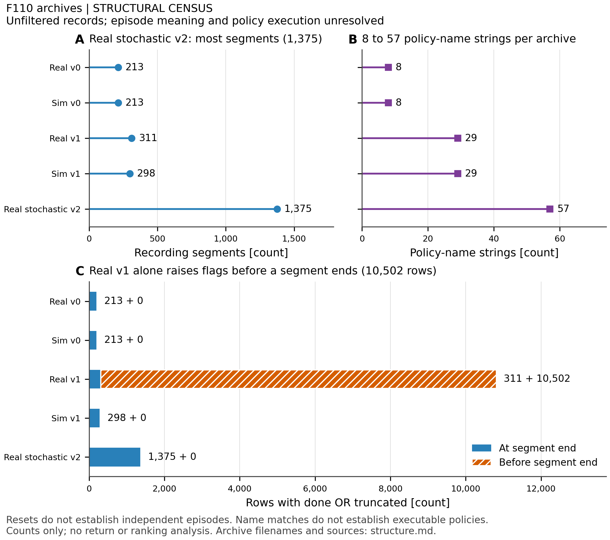

# F110 archive qualification

The structural census reproduced the prior audit. Empirical policy evaluation
remains blocked: reuse terms, episode meaning and policy executability are
unqualified. The [result](../runs/ope_qualification/result.json) records the
executed findings; the [table](../runs/ope_qualification/structure.md) and
[figure](../runs/ope_qualification/structure.png) are generated from it.

This is the first result for the owner's adopted question: can model disagreement
identify controller rankings that should be withheld? It reports no ranking,
return, model fit or validated refusal method.

## Inputs and method

[inputs.json](../runs/ope_qualification/inputs.json) pins explicit archive URLs,
SHA-256 hashes, internal Zarr roots and inspected source files. Archives were
reused from the earlier audit cache. Their structure had already been inspected;
this reproduction is not a preregistered or blinded result. No earlier reserved
Zenodo driving bag was opened.

[qualify_ope_archives.py](../experiments/qualify_ope_archives.py) verifies hashes
before decoding only `timestep`, `model_name`, `done`, `truncated` and `log_prob`.
It never imports the upstream loader, actor or estimator. Rewards, observations,
actions and recorded performance are not decoded. The raw-byte hash necessarily
reads the entire ZIP as opaque bytes. Missing chunks raise an error, so implicit
fill values cannot silently create resets or policy IDs.

A recording segment begins when `timestep` stops increasing. An independent
start-marker rule checks the same boundaries, including the one-based
simulation-v0 convention. Unit progression, constant policy names within each
segment and end-flag alignment are checked. The real-v1 archive contains both
nested and root structural arrays; the selected root is explicit and the
alternative arrays compare equal. Raw segment counts precede upstream filters
and do not identify independent cars, sessions or physical experiments.

## Recording boundaries and loader aliases



*Panel C counts each `done OR truncated` row once and splits it by position
relative to the segment end. Blue solid bars are at-end flags; orange hatched bars
are earlier flags. The linear count axis starts at zero.
[SVG](../runs/ope_qualification/structure.svg) ·
[Archive identity and count tables](../runs/ope_qualification/structure.md#archive-identity-and-recordings) ·
[Loader registration table](../runs/ope_qualification/structure.md#loader-registrations).
Version-paired rows do not establish paired experiments.*

Real v1 has repeated end flags before its recording boundaries. The other
inspected archives align those flags with structural ends. This verifies a
structural discrepancy, while the physical meaning of continuing `done` flags
remains unresolved. Collision, absorbing-state, reset and truncation handling
must be agreed before defining transitions or an outcome.

The pinned [dataset loader](https://github.com/HyberionBrew/f1tenth_orl_dataset/blob/66d03630cc651cb80b87f1d86000e7f2ec8d3589/f110_orl_dataset/dataset_env.py)
sets timeouts from truncation or termination and builds trajectories from those
flags. This qualification does not apply its cleaning filters. Their intended
raw-to-filtered correspondence remains a source question.

Literal AST inspection of the pinned
[registrations](https://github.com/HyberionBrew/f1tenth_orl_dataset/blob/66d03630cc651cb80b87f1d86000e7f2ec8d3589/f110_orl_dataset/__init__.py)
reproduces the aliases: `f110-real-stoch-v1`, `f110-real-stoch-v2` and
`f110-sim-stoch-v2` all select `f110-sim-v1.zip`. The last is a simulation-labeled
alias. The v2 evaluation names are absent from that selected archive but present
in the explicit real-stochastic archive. Some bad-trajectory indices also exceed
the selected archive's row count. See `registrations` in the result for exact
names and indices. This establishes the source mapping, not what an earlier
paper actually loaded. No upstream mapping is silently repaired here.

## Policy correspondence and probabilities

The script compares actual archived `model_name` strings against filenames in
the pinned code trees. It records every match and missing name. Real stochastic
v2 names match the benchmark's configuration filenames; the v0 names match the
bundled dataset configurations. Real and simulated v1 have limited exact name
intersection. Names with different suffixes are never automatically joined.

The pinned [Agent loader](https://github.com/HyberionBrew/stochastic_ftg_agents/blob/44ed59d5abb551eff0ee322fa82d4b22cf5c372a/f110_agents/agent.py)
resolves a name to a JSON file and dispatches on agent class. A filename match
is only a candidate correspondence. Configuration contents, dependencies,
weights, observation reconstruction, units, action transforms and internal
state/reset behavior still need qualification before any target callable is
used on logged next states.

The inspected [actor source](https://github.com/HyberionBrew/f1tenth_orl_dataset/blob/66d03630cc651cb80b87f1d86000e7f2ec8d3589/f110_orl_dataset/dataset_agents.py)
has PPO action and probability-evaluation paths and an explicitly dummy actor
that returns a constant negative log probability. Saved model paths exist in
the inspected tree. Policy access is therefore partial, rather than entirely
absent. The handoff also names `partialPPOpolicy` support; that symbol was not
located in the inspected pinned helpers, so its exact source revision remains
an explicit question in the author draft. Neither helper availability nor a
saved-model filename proves executable coverage of the observed policy IDs.

The result records log-probability shape, finiteness and whether all entries
are zero. These are representation checks only. Zero simulation entries and
the dummy actor must not be treated as valid behavior densities. The paired
real-data coordinates require documented joint-density semantics, including
clipping/scaling and any dependence between action coordinates. No missing
probability is imputed or multiplied into a weight.

## Estimator gates

| Method | Required evidence | Current status |
| --- | --- | --- |
| Finite-horizon reference outcome | Permission, episode semantics, fixed horizon/reward, censoring and collision rules, real/sim pairing and independent groups | Not executed; outcome arrays remain uninspected |
| FQE | Qualified target actions at reconstructed next states, coverage, suitable value approximation and the same finite-horizon convention | Execution unqualified. Behavior probabilities are not a prerequisite |
| IS / WIS / ratio-based DR | Additionally qualified joint target/behavior likelihoods and support for the executed-action convention | Ineligible now; stored arrays or a callable alone cannot establish this |
| Model-disagreement ranking/refusal | Qualified reference outcomes, frozen development/evaluation groups, comparisons at matched retention against simpler baselines | No empirical campaign authorized or executed |

FQE's next-state target actions follow
[Le et al., Algorithm 3](https://proceedings.mlr.press/v97/le19a/le19a.pdf).
Likelihood ratios appear explicitly in
[Jiang and Li, sections 3 and 4](https://proceedings.mlr.press/v48/jiang16.pdf).
Invalid behavior probabilities alone do not exclude FQE, but unresolved target
execution and coverage do. No estimator compensates for absent support merely
by reporting a precise value.

## Rights and stop condition

The inspected data and code trees have no license-filename candidates. The
inspected dataset README supplies no explicit reuse grant. This records an
unknown permission state, not a legal determination that reuse is prohibited.
The repository's MIT license and the earlier driving bag's separate CC BY terms
do not supply these missing grants. Third-party ZIPs, weights and source code
are not redistributed in this PR.

The [contact record](../docs/ope_author_request.txt) records the owner's
confirmation that the email to Fabian Kresse was sent. The retained request
covers permissions, recording/episode/policy mapping, loader intent and
probability semantics. No reply has been supplied. Empirical OPE and a numerical
finite-horizon reference stay stopped until those prerequisites qualify.
[Open questions](../docs/OPEN_QUESTIONS.md) retains owner decisions; the
[roadmap](../ROADMAP.md) records the current blocker.

## Reproduce

### Redraw from the committed result

These commands need no archive cache and run no qualification or outcome analysis.
Use Python 3.11 with `requirements-ope-qualification.txt` installed:

```bash
python experiments/plot_ope_structure.py \
  --result runs/ope_qualification/result.json \
  --output runs/ope_qualification/structure.png
```

This writes PNG and SVG figures, `structure.md`, `structure.csv` and
`loader_aliases.csv`. The result remains the single numerical source. The
[figure guide](../docs/data-and-figures.md#visual-redesign-and-preservation)
records visual choices and preservation checks.

### Original structural qualification

Use Python 3.11 and the separate [requirements](../requirements-ope-qualification.txt).
Put the files named in `inputs.json` in an external cache using their pinned
URLs. Reuse the existing cache where available; no bulk acquisition is needed
for this result. GitHub tree JSON is hashed after canonical JSON serialization
so response formatting is immaterial. Source-code and ZIP hashes bind bytes.

```bash
python -m pip install -r requirements-ope-qualification.txt
python experiments/qualify_ope_archives.py \
  --cache "$RACING_OPE_CACHE" --output /tmp/racing-ope-reproduction
RACING_OPE_CACHE="$RACING_OPE_CACHE" python experiments/test_ope_qualification.py
python experiments/plot_ope_structure.py \
  --result /tmp/racing-ope-reproduction/result.json \
  --output /tmp/racing-ope-reproduction/structure.png
```

`result.json` is deterministic for the pinned inputs and qualification script.
The integration test compares the reproduced result, verifies actual policy
mapping and forbids decoding any nonstructural archive member. Unit tests cover
repeated terminals, one-based starts, singleton tails, policy changes, timestep
gaps, hash rejection, exact names, AST parsing and partial/missing chunks.
Without the cache, only unit tests run and the integration test is marked skipped.

The [execution record](../runs/ope_qualification/execution.json) states the
actual environment and separate comparison with the prior audit. The
qualification reader retains its original simple table output; the rendering
command above replaces that view with the expanded tables. No outcome or actor
execution is needed to rerun this qualification.
