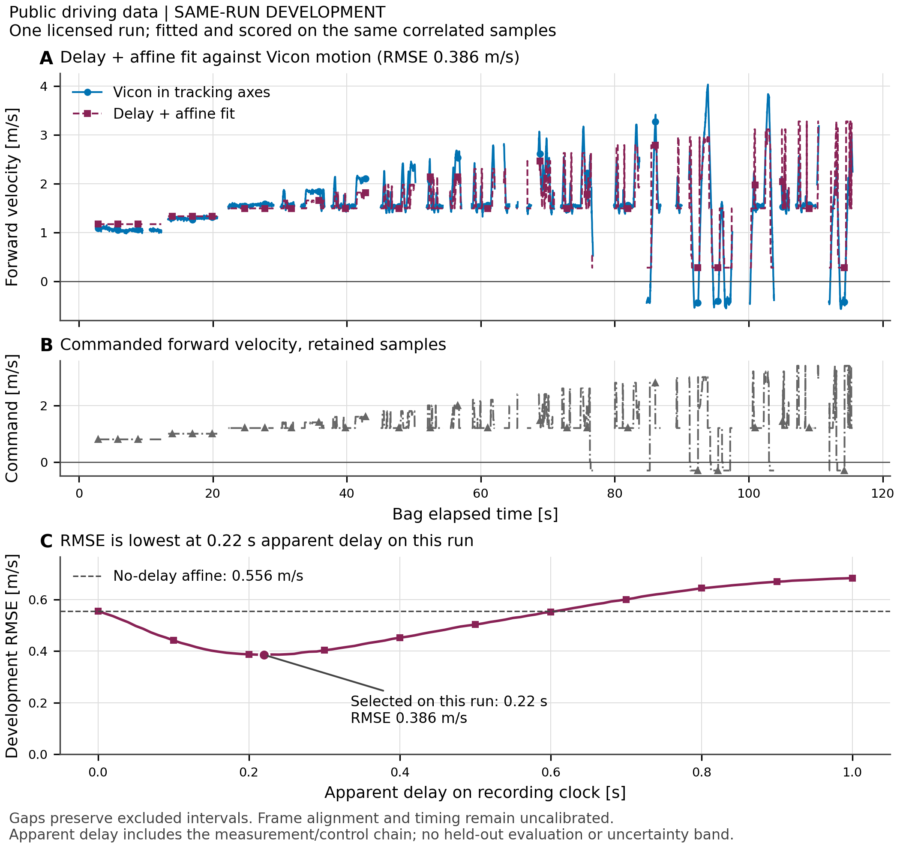

# Public driving-data development result

Retained development study. The active question is now [ranking-refusal archive
qualification](ope_qualification.md). Its adoption does not reopen the unassigned
bags or resolve this study's session-provenance blocker.

The delay-plus-affine fit reduces forward-velocity residuals against the
no-delay affine baseline on one development run. The fitted values, baseline
errors and sample exclusions live in
[result.json](../runs/real_command_response/result.json). This establishes a
runnable command-response comparison. Generalization to another run remains
untested. The subsequent [split qualification](driving_split_qualification.md)
stopped before opening another bag: acquisition-session and segment membership
remain undocumented. The [roadmap](../ROADMAP.md) retains that blocker and the
unanswered K2 disposition; neither closure nor resumed fitting is implied.



## Source and inspection

[Driving Data of a Real F1tenth Car](https://zenodo.org/records/12536536), by
Zengjie Zhang with data collected by Giannis Badakis and Michalis Galanis at
Eindhoven University of Technology, is licensed
[CC BY 4.0](https://creativecommons.org/licenses/by/4.0/). Attribution applies to
the derived motion samples and plots. The analysis code follows this repository's
MIT licence. [source.json](../runs/real_command_response/source.json) records
retrieval URLs, revision, date, SHA256 hashes, the download cap and the untouched
bags. The smallest bag was chosen from file sizes before inspecting motion.
Raw data stays outside git.

[The complete inventory](../runs/real_command_response/inventory.json) records
every topic and message type, count, rate over observed span, interval
quantiles, longest gap, duplicate/backward times, frames, and unit provenance.
Header and recording clocks are reported separately. Event-driven topics do
not have a meaningful nominal sampling rate; their large gap counts should be
read alongside the stated descriptive gap rule.

The bag contains Vicon pose, twist and an acceleration-named Twist topic,
VESC telemetry, servo and motor commands, odometry, laser scans, emergency
signals, transforms, visualization, diagnostics and logs. VESC's embedded
[message definition](../runs/real_command_response/vesc_message_definition.txt)
states electrical motor RPM. The servo sensor-named topic repeats the command
sequence after an initial value; it does not establish measured wheel angle.

## Calculation

1. Deserialize with `rosbags`, without ROS. Use bag time for command-response
   alignment because the command has no header. Inspect the large offset
   between header and bag clocks rather than mixing them.
2. Match each Vicon twist to the most recent pose on their shared header clock.
   Normalize its quaternion and calculate `v_tracking = R(q).T @ v_world`.
   Use tracking-frame forward velocity as the exploratory target. Maximum pose
   age and command age are recorded under `method` in the result.
3. For each candidate nonnegative delay, hold the latest command causally and
   fit `v_tracking(t) = gain * command(t - delay) + offset` by least squares.
   Use the same intersection of valid samples for all delays and baselines.
   Report mean-only, identity-command and no-delay affine baselines. No filter
   or interpolation fills command gaps.
4. Choose the minimum development RMSE from
   [the full delay profile](../runs/real_command_response/delay_profile.json).
   The fit and score use the same run. The plot breaks at excluded intervals.
   [comparison.csv](../runs/real_command_response/comparison.csv) contains only
   elapsed time, command, transformed velocity and fitted prediction.

The search extent and age limits are exploratory processing choices, not
calibrated tolerances. The time-weighting is one weight per retained Vicon
message. Samples are correlated. No confidence interval or pass threshold is
assigned. Emergency flags are inspected but do not select the fitting subset.

## Limits and candidate decisions

Tracking-to-car alignment, Vicon scale and filtering, sensor lever arm and
clock synchronization have no supplied calibration here. The rotation assumes
tracking x follows vehicle forward. The apparent delay includes recording,
transport, tracking processing and onboard controller/drivetrain response.
Steering and emergency actions can confound a scalar fit; the fitted offset
must not be treated as a physical equilibrium at zero command.

No IMU message or independently measured steering channel was identified.
VESC voltage and fault fields fail basic plausibility checks. The acceleration
and angular channels have unverified processing and unit semantics, so neither
is used to claim tire parameters or loads. Mass, CG and electrical-RPM conversion
are also unresolved. This is public-car evidence, separate from the owner's
vehicle and structural design requirements.

[Candidate findings](../runs/real_command_response/candidates.json) distinguish
inspected channels from paper/landing-page claims:

- [The steering paper](https://arxiv.org/html/2409.19356v1) describes richer
  onboard sensing. Its public processed release does not establish raw dynamics
  channels or a data reuse licence. No archive was downloaded.
- [IEEE DataPort](https://ieee-dataport.org/documents/rosbag220240719110137-dataset)
  declares a data licence in its landing metadata, but requires a subscription
  to retrieve the bag. Listed channels alone do not establish a usable dynamics
  dataset. No login or purchase was attempted.

These checks support retaining command-response scope. Follow-up work and the
separate mounting decision are in [ROADMAP.md](../ROADMAP.md).

## Reproduce

Use Python matching `environment.python` in the result, in a separate environment.
The frozen environment applies only to this study; it does not replace CI's
existing environment. Set `RACING_DATA_DIR` to a directory outside the checkout.
The bag URL and expected hash are in the source record. The program refuses a
bag with a different hash, keeping unopened runs out of this development fit.

```bash
python3.13 -m venv /tmp/racing-data-env
/tmp/racing-data-env/bin/python -m pip install -r runs/real_command_response/environment.txt
export RACING_DATA_DIR=/tmp/racing-public-data
mkdir -p "$RACING_DATA_DIR"
curl -fL --max-filesize 90000000 --max-time 300 \
  -o "$RACING_DATA_DIR/ex-hard-r2_2023-06-12-19-59-52.bag" \
  https://zenodo.org/api/records/12536536/files/ex-hard-r2_2023-06-12-19-59-52.bag/content
/tmp/racing-data-env/bin/python experiments/real_command_response.py \
  --bag "$RACING_DATA_DIR/ex-hard-r2_2023-06-12-19-59-52.bag" \
  --output /tmp/racing-development-reproduction
/tmp/racing-data-env/bin/python experiments/test_real_command_response.py
```

Owner exercise: use `owner_frame_exercise` in the result to independently
construct the quaternion rotation matrix and reproduce the transformed velocity.
Then recompute the minimum of the delay profile and the RMSE from the CSV as
`sqrt(mean((tracking_forward_m_s - delay_affine_m_s)**2))`. Explain why this is a
development error. Held-out error must wait for the whole-run split and analysis
choices to be frozen; this PR does not evaluate it.
